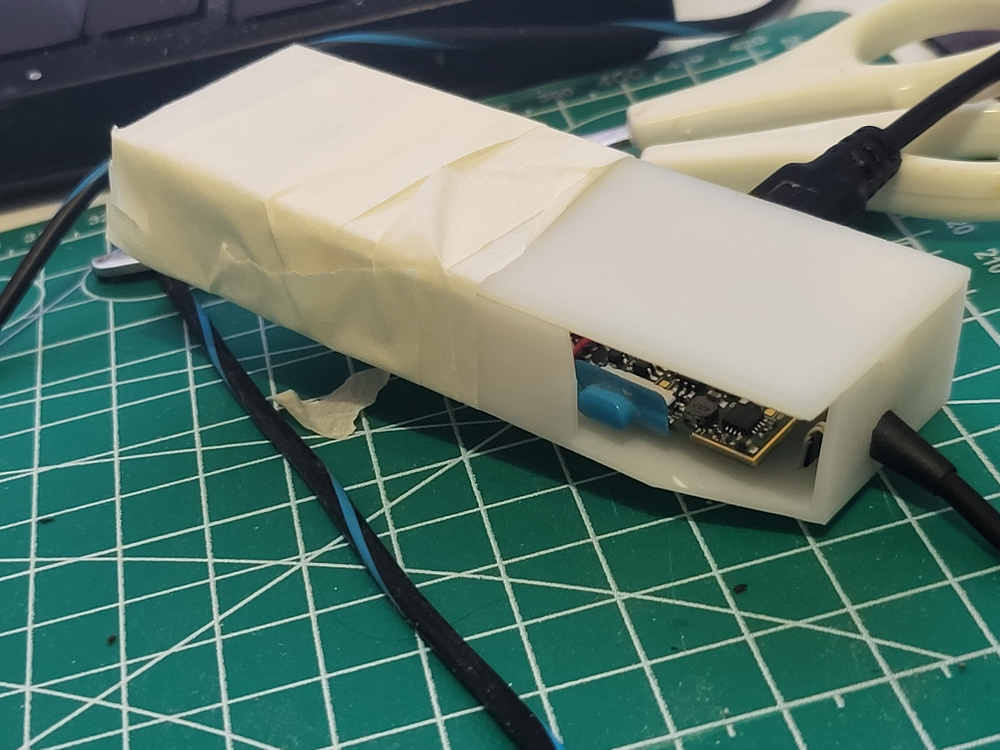
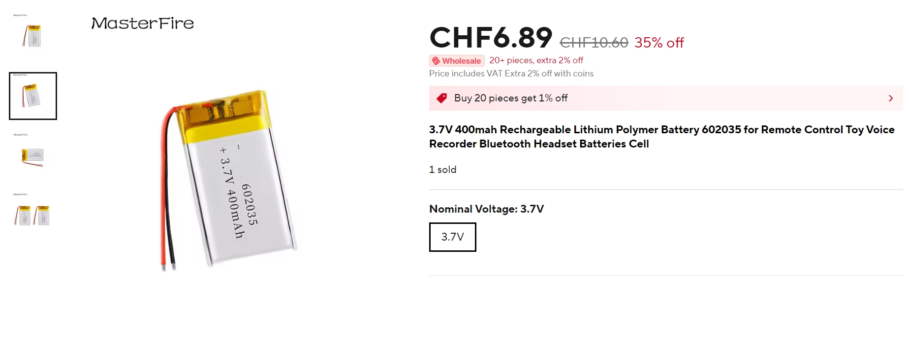
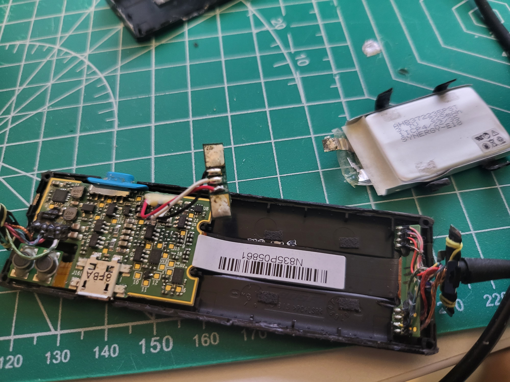
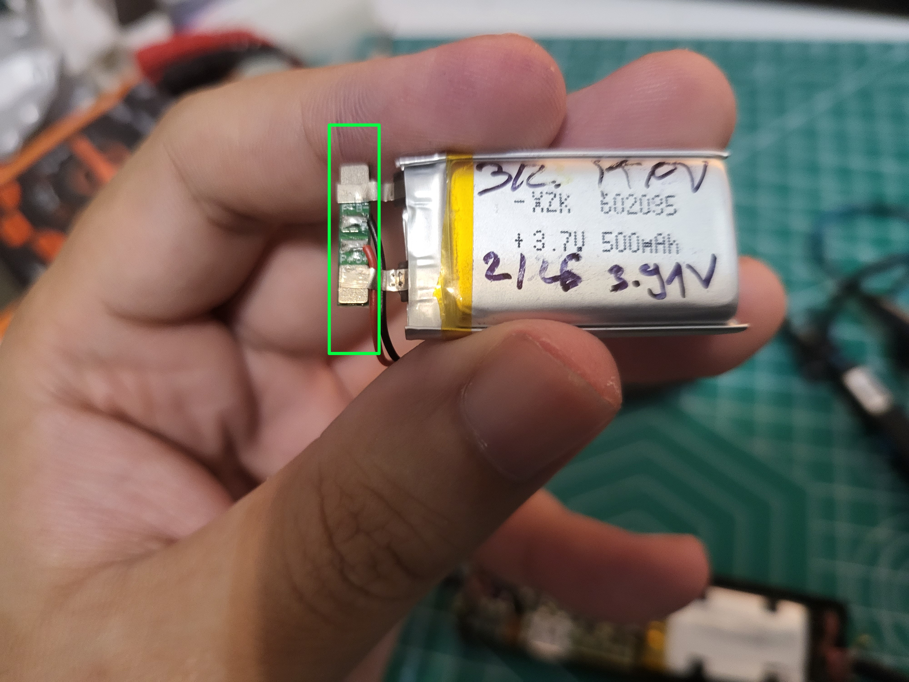
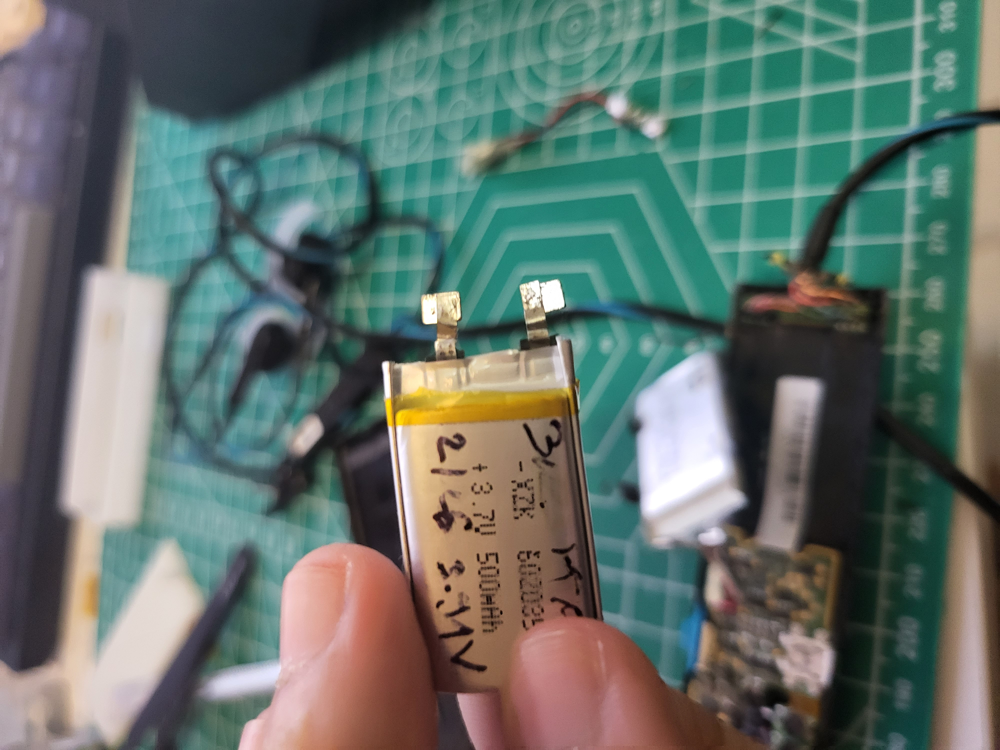
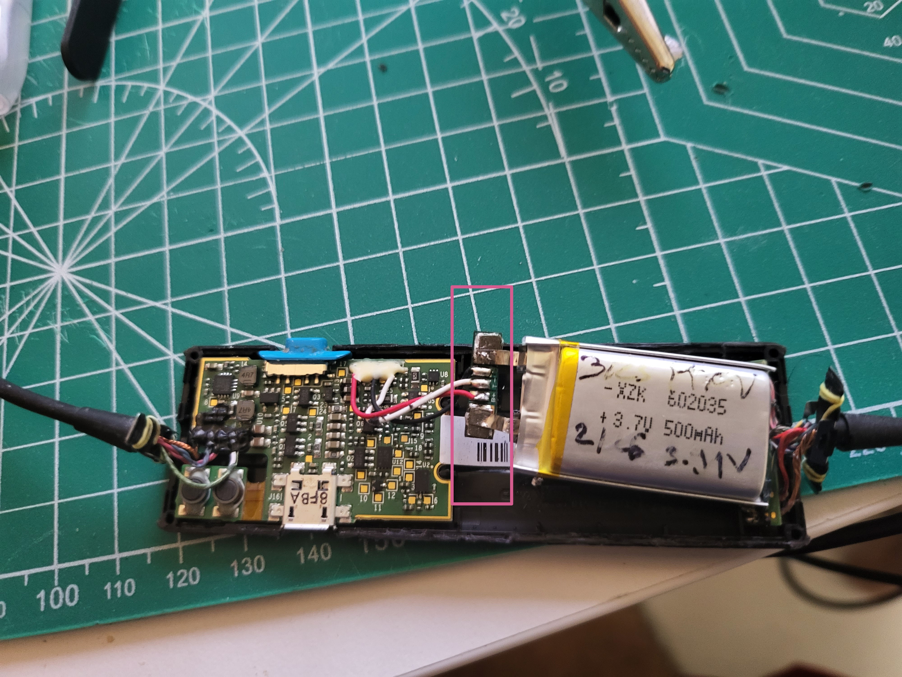
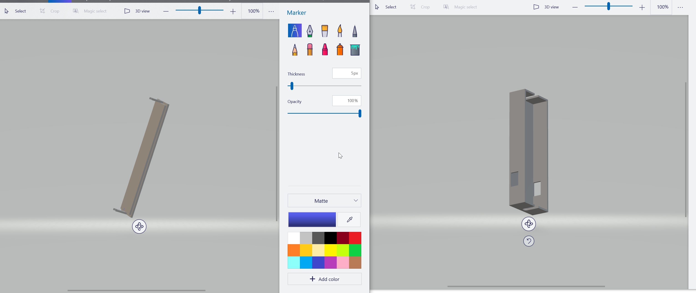

# Revive Your Bose QC20 (in 2025): A Step-by-Step Battery Replacement Guide

## Bose QC20s (QuietComfort 20), famous for their amazing ANC (and being the last wired in ear option by Bose), are discontinued and Bose won't replace the battery.  This guide provides simple, pictured steps to install a new battery and keep your QC20s working perfectly (potentially forever).

### Tools you will need

1. Soldering Iron , solder
2. A Multimeter
3. A knife/sponger/cutter
4. Sticky tape/Kapton tape
5. (Optional: a 3d printer/access to a 3d printing service)

### Things you will need to buy 
1. A replacement battery
2. A new 3d printed shell casing if you choose a larger battery than the original one

### Replacement batteries
The QC20 uses a generic 3.7V Li-Ion Battery , which follows the naming convention all in mm (Length|Widthness|Thickness*10). You do not need to buy a special battery for the QC20. For example the one in the picture will actually work, what matters is that the voltage is the same and that the battery fits into your case. The original in my unit has the sizes: 372235 , and only a capacity of 225 mAh. I replaced it with 602035 (500 mAh).

### Opening the original case and checking polarity
The original shell is made of two plastic pieces which are glued together and held together by small tabs, and another piece of plastic foil which is wrapped around it. Start by removing the plastic foil. Then pry open at the edge where the charging port is. When using a knife/cutter  make sure not to cut any wires (inserting the blade too deep when prying), and not to puncture the battery itself. 

.jpg)

The PCB and battery are glued/taped to the half underneath the on/off switch (blue rectangle) , so when opening the case make sure to lift the half of the shell above the on/off switch. or you might tear stuff out. In the teal rectangle you can see 1. the control board for the old battery and 2. the tab of the old battery which is attached to it. 

Before you  desolder the old battery CHECK THE POLARITY using the multimeter. The tab placement of your replacement battery must match polarity wise with the original batteries polarity or you will fry your QC20. 

Our main goal is to desolder the old battery but reuse the control board that it comes with. You will have to cut open the Kapton tape to access the board and remove the black tape from the battery to free it.  Soldering a new battery directly to the PCB (and removing the old control board) will NOT work. You do not have to discharge/match the charge of the old battery. But you have to reuse the control board of the original battery. 

After you have desoldered the old battery and freed it it should look like this. 

  

### Preparing the replacement battery
The replacement battery usually comes attached to a control board (green rectangle) of its own, which you will need to desolder 

Making your replacement battery look like this 

Now using the Multimeter check the voltage (don't waste your time soldering on a dead replacement) and match the polarity and solder on the replacement. At this point (after you have soldered) check the polarity again. If the polarity matches turn it on and everything should work. You can now either

1. Remove the PCB and the rest of the unit completely from the old shell and insert it into a new custom shell
2. Reuse the old shell and reassemble everything (if your replacement matches the original) 

### Custom shell 

Well , I dont know anything about 3d printing or modelling, so i made some halfassed custom shell and used a chinese 3D Printing service to get it printed.The result is good enough for me (I don't travel with my QC20s), and I only care about ANC and not having to recharge my QC20s all the time. 

You can find the files I created under Part11.stl and Part22.stl (essentially a box with a lid). I must say that the headphone tension holders fit quite nicely, however the cutouts for the charger and on/off switch do not. But this can be fixed by cutting them open manually if you don't care aabout aesthetics. Or if you are savvy with 3d stuffy ou can probably just fix the models  ;) 

That's pretty much everything and it's surprisingly easy to do. 

I hope this guide helped you and wish you a long and noiseless life. 

